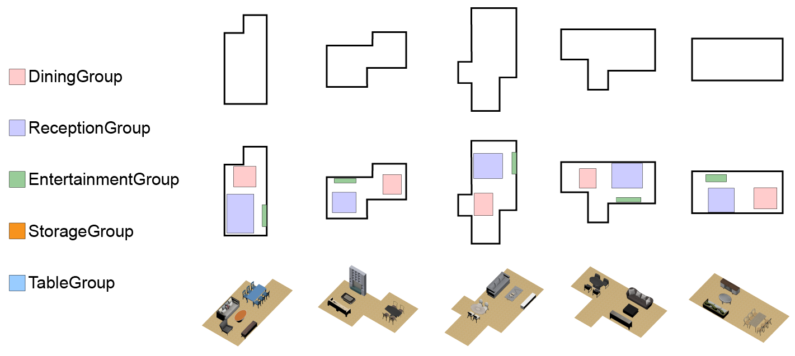

# FuncScene: Function-centric Indoor Scene Synthesis via a Variational AutoEncoder Framework

  
    

This repository contains the code that accompanies our paper [FuncScene: Function-centric Indoor Scene Synthesis via a Variational AutoEncoder Framework](https://wutomwu.github.io/particulars.html?id=6).

## Configuration
- Python 3.7
- Pytorch 1.8.1
- Numpy 1.21.6
- Torchvision 0.8.2
- Pytorch-fast-transformers 0.4.0
- WxPython 4.1.1

## Dataset
We use the [3D-FRONT](https://tianchi.aliyun.com/specials/promotion/alibaba-3d-scene-dataset) dataset and the [3D-FUTURE](https://www.google.com/search?q=3d-future&oq=3d-fut&aqs=chrome.1.69i57j0j0i30l8.3909j0j7&sourceid=chrome&ie=UTF-8) dataset with some preprocessing. These data processing procedures are described in detail in our paper.

## Train
Our model is divided into three modules: functional category prediction, function group generation and function group instantiation. You can directly run the "main.py" file to train and generate indoor scenes.

## Test
After the model training is completed, you will get the "funcscene.pth" file, you only need to slightly modify the "main.py" file to load the model parameters to generate the indoor scene.

## Instantiation
Our model's rendering is based on ATISS's code. To instantiate indoor scenes, you need to download the 3D-FRONT and 3D-FUTURE datasets first. Then, use the 'pickle_threed_future_dataset.py' file from ATISS to pickle the 3D-FUTURE dataset and place the generated pkl file in the './data/pickle' folder. Finally, run the test code to proceed.
